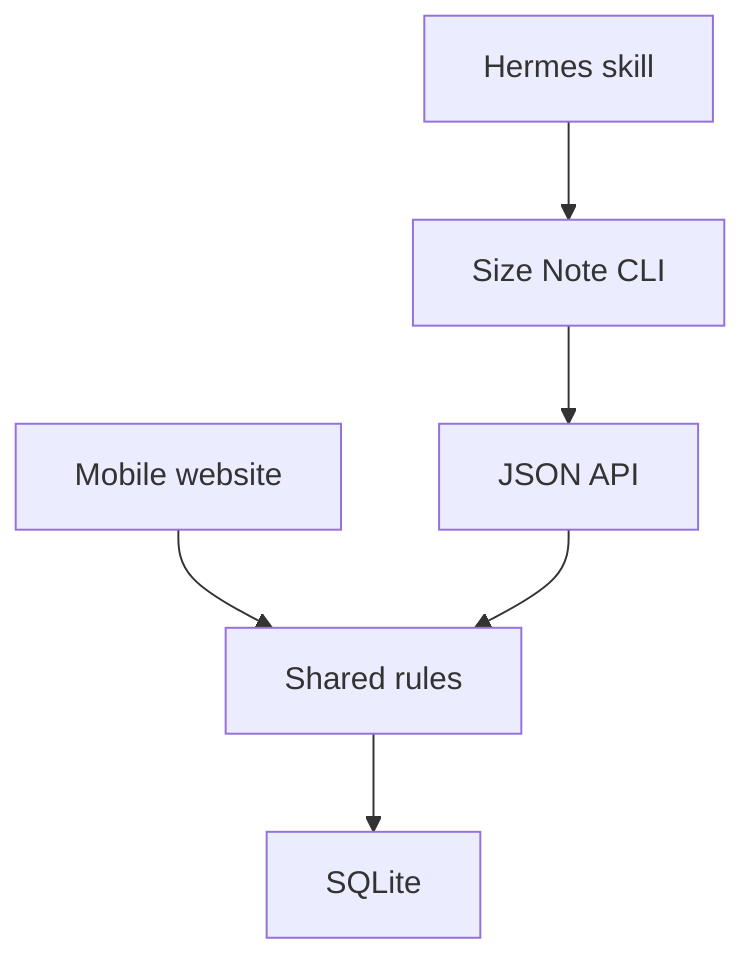

# Size Note

Size Note is a private, self-hosted place to remember clothing, footwear, ring, hat, and other wearable sizes for the people you shop for. It includes a phone-friendly website, a JSON API, a CLI designed for AI agents, and a small Hermes skill. It does not use MCP.

## Current scope

- Stores a canonical person name, confirmed aliases, `adult` or `child`, and optional notes.
- Keeps relationship context in optional notes instead of building a family model.
- Stores general or brand-specific sizes, sizing systems, models, and fit notes.
- Preserves previous sizes when a value changes.
- Treats re-entering the same size as verification rather than a duplicate.
- Suggests reviews for children: 3 months for shoes and 6 months for other items.
- Requires confirmation before a similar name becomes an alias.

Automatic size conversion is intentionally outside the initial scope. Saved values are confirmed values.

## Install on a Hermes host

Docker Compose and Python 3.11+ are prerequisites. The installer checks for them but does not install Docker.

```bash
git clone https://github.com/OWNER/size-note.git
cd size-note
./install.sh --profile my-profile
```

This builds and starts the container, creates the persistent `data/` directory, installs the host CLI into `~/.local/bin`, copies the skill into the selected Hermes profile, and waits for a health check. Rerunning the installer is safe and preserves the SQLite database.

For a non-Hermes installation:

```bash
./install.sh --no-skill
```

The website listens at `http://127.0.0.1:3010` by default. Keep that private binding and publish it through Tailscale Serve or an existing trusted reverse proxy for phone access. Set `SIZE_NOTE_PORT` in `.env` to change the host port.

## CLI

Create a person:

```bash
size-note person-add "Alexandra" --growth-stage adult --alias "Alex"
size-note person-add "Sam" --growth-stage child --notes "Prefers soft fabrics"
```

Save and retrieve sizes:

```bash
size-note remember --person "Sam" --item shoes --size "15 cm" --system JP
size-note remember --person "Alexandra" --item tshirt --size M --brand "Example Brand"
size-note get --person "Alex" --current-only
size-note review
```

Every command supports `--json`. Expected identity outcomes such as `confirmation_required`, `multiple_matches`, and `not_found` return structured data without changing anything.

After a user confirms that `Alex` means the suggested Alexandra record:

```bash
size-note remember \
  --person "Alex" \
  --confirm-person-id "PERSON_ID_FROM_THE_RESULT" \
  --remember-alias \
  --item tshirt \
  --size M \
  --json
```

## Local development

```bash
uv sync --extra dev
uv run alembic upgrade head
uv run uvicorn size_note.main:app --reload --port 3010
```

Run checks:

```bash
uv run ruff check .
uv run pytest
```

`tests/api_contract.json` locks the public routes and schemas. An intentional API
change must be reviewed for CLI and Hermes compatibility before updating that
contract snapshot.

## Architecture

The website and JSON API call the same Python service layer. The CLI calls the API, and Hermes calls the CLI through its existing terminal capability.



SQLite data lives at `data/size-note.db` and is mounted outside the container. Database upgrades use Alembic migrations.

## API

Interactive API documentation is available at `/docs` while the service is running. Core routes are:

- `POST /api/people/resolve`
- `POST /api/people`
- `POST /api/people/{id}/aliases`
- `POST /api/sizes`
- `POST /api/sizes/{id}/verify`
- `GET /api/people/{id}/sizes`
- `GET /api/reviews`
- `GET /health`

## License

MIT
