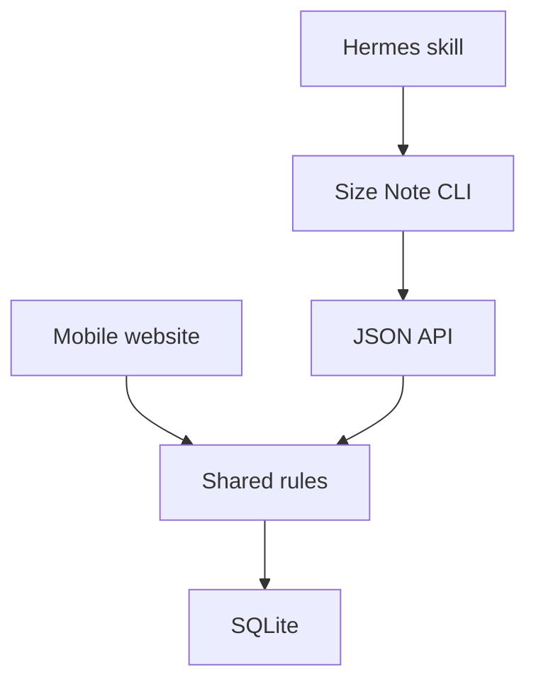

# Size Note

Size Note is a private, self-hosted place to remember clothing, footwear, ring, hat, and other wearable sizes for the people you shop for. It includes a phone-friendly website, a JSON API, a CLI designed for AI agents, and a small Hermes skill. It does not use MCP.

## Current scope

- Stores a canonical person name, confirmed aliases, an adult/child fallback, optional partial birth information, and optional notes.
- Treats aliases as alternative names or identifying phrases such as `Alex`, `me`, `myself`, or `my son`.
- Keeps stable preferences and other non-identity person context in optional notes.
- Accepts birth information as year only, year + month, or a full date; unknown month/day values are never invented.
- Uses birth information, when present, to determine whether a person is effectively a child or adult. Partial dates stay conservative until the person is definitely 18.
- Stores general or brand-specific sizes, sizing systems, models, and fit notes.
- Groups confirmed equivalent sizing systems into one physical fit record.
- Preserves previous sizes when a value changes.
- Treats re-entering the same size as verification rather than a duplicate.
- Suggests age-aware reviews for children, using each size record's last verification time.
- Requires confirmation before a similar name becomes an alias.

Automatic size conversion is intentionally outside the initial scope. Saved values are confirmed values.

## Names, aliases, and notes

Each person has one canonical display name. An **alias** is another name or phrase that should resolve to that same person. This includes nicknames, self-references, and relationship phrases when they identify one person unambiguously.

Examples:

- `Alexandra` with alias `Alex`
- `Alex` with aliases `me` and `myself`
- `Riley` with alias `my son`

Aliases are for **identity**. Person notes are for stable facts or preferences that are not used to identify someone, such as `prefers soft fabrics` or `usually likes a relaxed fit`.

A relationship phrase does not determine age. For example, `my son` can be stored as an alias when it clearly refers to one person, but Size Note still uses structured birth information or the explicit child/adult fallback for growth behavior. If a relationship phrase could refer to multiple people, confirm which person it means before saving it as an alias.

## People, birth information, and review timing

A person's birth information is optional. Store only the precision you actually know:

- `2024` — year only
- `2024-05` — year and month
- `2024-05-12` — exact date

On the website, these are presented as three separate **Year**, **Month**, and **Day** fields instead of asking people to type an ISO date. All three are optional. Month is available only after a year is entered, and day is available only after a month is selected. Clearing the year also clears month/day; clearing the month also clears the day. The server validates the same hierarchy, so the rule does not depend on browser JavaScript.

For Hermes and the CLI, the compact form remains convenient: `--birth 2024`, `--birth 2024-05`, or `--birth 2024-05-12`.

Size Note does not convert an unknown birthday to January 1 or the first day of a month. When the exact age is uncertain, it uses the younger possible age so reminders do not stop too early.

Birth information drives the effective child/adult stage when present. A person becomes effectively adult only when they are definitely 18. For example, someone stored only as born in `2008` remains effectively a child through 2026 and becomes an adult from 1 January 2027 without a scheduled database update. The stored `growth_stage` remains a fallback for people without birth information.

For children with birth information, review intervals are intentionally simple:

- under 3 years: every 90 days
- 3–6 years: every 120 days
- 7–12 years: every 180 days
- 13–17 years: every 270 days
- definitely 18+: no automatic child review

If a child has no birth information, the fallback remains 90 days for shoes and 180 days for other items.

Each size has its own `verified_at` timestamp. Choosing **Still correct** updates that timestamp without creating history, so one person's shoes can be recently checked while an older T-shirt record is already due for review.

## Creating people

Size Note no longer silently assumes a new person is an adult.

- If birth information is supplied, the effective stage can be inferred automatically.
- If the user explicitly says adult, no birth information is needed.
- If the user explicitly says child, birth information is useful for better reminders but remains optional.
- If neither birth information nor an adult/child stage is known, ask which one applies before creating the person.

Aliases can be stored at creation time. For example, if `Riley` is the canonical name and `my son` is how the user refers to that person, store `my son` as an alias rather than as a note.

## Install on a Hermes host

Linux or macOS, Docker Compose, Python 3.11+ with `venv`, and Hermes are prerequisites. The Hermes profile must use `terminal.backend=local` because the skill calls a CLI installed on the host. The installer checks these requirements but does not install them or change Hermes configuration.

```bash
git clone https://github.com/teranchristian/size-note.git
cd size-note
hermes profile list
./install.sh --profile my-profile
```

Use `./install.sh --profile default` for the default Hermes profile. The installer rejects unknown profiles instead of creating new profile directories.

This builds and starts the container, creates the persistent `data/` directory, installs the host CLI into `~/.local/bin`, copies the skill into the selected Hermes profile, verifies CLI health and Hermes skill discovery, and then asks you to start a new Hermes session. Rerunning the installer upgrades the application while preserving the SQLite database. Alembic applies schema upgrades automatically, so adding fields does not require deleting the database.

For a non-Hermes installation:

```bash
./install.sh --no-skill
```

The website listens at `http://127.0.0.1:3010` by default. Keep that private binding and publish it through Tailscale Serve or an existing trusted reverse proxy for phone access. To use another port, edit `SIZE_NOTE_PORT` in `.env` or set it while installing:

```bash
SIZE_NOTE_PORT=3210 ./install.sh --profile my-profile
```

The installer configures the CLI to use the same port. An explicit `SIZE_NOTE_URL` environment variable can still override it.

Verify the installation from the host:

```bash
size-note health
hermes -p my-profile skills list
```

Then start a new Hermes session and ask it to remember or retrieve a size.

## Using Size Note with Hermes

Natural requests can include person identity, profile context, and size information together. Hermes should route each part to the appropriate Size Note field. Examples:

- `Remember that Riley is my son and wears T-shirt size 90 in Japan.` → `my son` is an alias; the size is a T-shirt record.
- `Remember that Alex is also me.` → `me` is an alias.
- `Alex prefers soft fabrics.` → that preference belongs in person notes.
- `What shoe size is my son?` → `my son` should resolve through the saved alias.

## CLI

Create people:

```bash
size-note person-add "Alexandra" --growth-stage adult --alias "Alex"
size-note person-add "Riley" --birth 2024 --alias "my son"
size-note person-add "Sam" --growth-stage child --notes "Prefers soft fabrics"
```

Manage aliases for an existing person:

```bash
size-note person-alias-list --person "Riley" --json
size-note person-alias-add --person "Alexandra" --alias "Alex" --json
size-note person-alias-update --person "Riley" --alias "my kid" --new-alias "my son" --json
size-note person-alias-delete --person "Riley" --alias "my son" --confirm --json
```

Update birth information later without changing the person's size history:

```bash
size-note person-update --person "Riley" --birth 2024-05
size-note person-update --person "Riley" --birth 2024-05-12
```

Save and retrieve sizes:

```bash
size-note remember --person "Sam" --item shoes --size "15 cm" --system JP
size-note remember --person "Alexandra" --item tshirt --size M --brand "Example Brand"
size-note get --person "Alexandra" --current-only
size-note review
```

A single physical fit can carry multiple confirmed representations:

```bash
size-note remember \
  --person "Alexandra" \
  --item shoes \
  --size "25.25" \
  --system CM \
  --equivalent EU:40 \
  --equivalent US:7
```

Every command supports `--json`. Expected identity outcomes such as `confirmation_required`, `multiple_matches`, and `not_found` return structured data without changing anything.

After a user confirms that `Alex` means the suggested Alexandra record, the existing size-save flow can also remember that wording as an alias:

```bash
size-note remember \
  --person "Alex" \
  --confirm-person-id "PERSON_ID_FROM_THE_RESULT" \
  --remember-alias \
  --item tshirt \
  --size M \
  --json
```

For a standalone identity statement, prefer `person-alias-add`.

## Local development

```bash
uv sync --extra dev
uv run alembic upgrade head
uv run uvicorn size_note.main:app --reload --port 3010
```

Run checks:

```bash
uv run ruff check .
uv run pytest
./scripts/requirements-lock.sh
```

`tests/api_contract.json` locks the public routes and schemas. An intentional public API change must be reviewed for CLI and Hermes compatibility before updating that contract snapshot. Internal CLI-support routes are kept out of the public OpenAPI contract.

`requirements.lock` is exported from `uv.lock` and is used by both Docker and the host installer, so fresh installations use the dependency versions tested by CI.

## Architecture

The website and JSON API call the same Python service layer. The CLI calls the API, and Hermes calls the CLI through its existing terminal capability.



SQLite data lives at `data/size-note.db` and is mounted outside the container. Database upgrades use Alembic migrations.

## API

Interactive API documentation is available at `/docs` while the service is running. Core public routes are:

- `POST /api/people/resolve`
- `POST /api/people`
- `PATCH /api/people/{id}`
- `POST /api/people/{id}/aliases`
- `POST /api/sizes`
- `POST /api/sizes/{id}/verify`
- `GET /api/people/{id}/sizes`
- `GET /api/reviews`
- `GET /health`

## License

MIT
